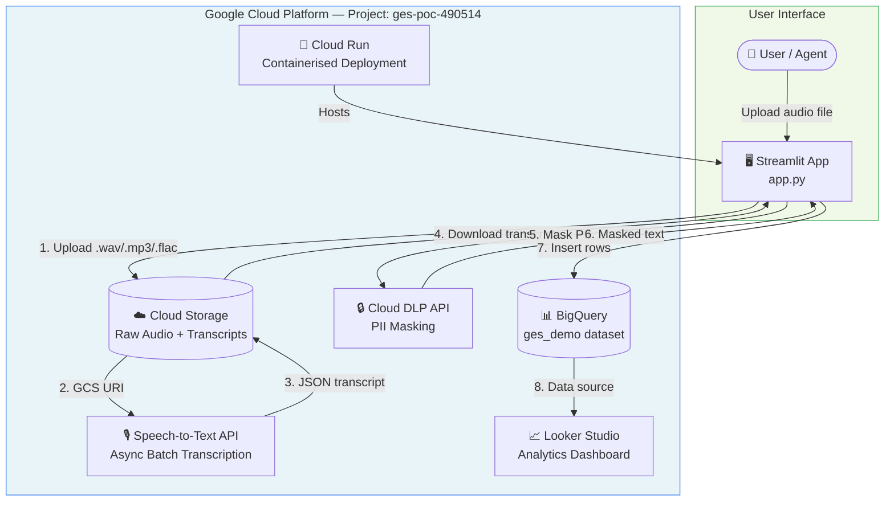
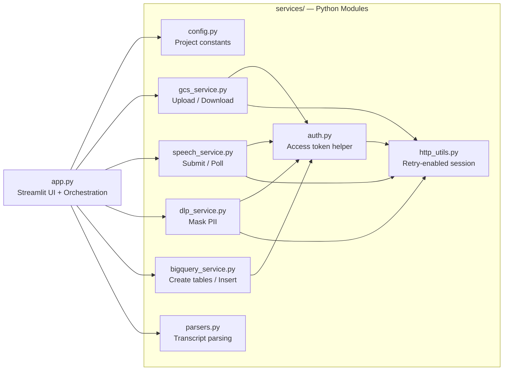

# Architecture

## Architecture Overview

The application uses a lightweight interface and a modular service layer. The UI remains responsible for orchestration, while service modules encapsulate cloud-specific operations.

## Component Model

| Layer | Component | Responsibility |
|---|---|---|
| Presentation | Streamlit UI (`app.py`) | User interaction, upload, process trigger, status display |
| Storage | Cloud Storage | Raw audio storage and transcript output storage |
| Processing | Speech-to-Text v2 | Batch transcription of uploaded audio |
| Parsing | `parsers.py` | Transcript extraction, normalization, field parsing |
| Privacy | Cloud DLP | PII masking of transcript content |
| Persistence | BigQuery | Storage of raw and masked results |
| Reporting | Looker Studio | Consumption of masked analytics data |

## Architectural Principles

### 1. Managed cloud services

The solution is intentionally designed around managed GCP services to minimize platform overhead and reduce the need for custom infrastructure components.

### 2. Service separation

Each external integration is isolated into a dedicated module under `services/`. This improves readability, maintainability, and testability.

### 3. Privacy partitioning

Raw transcript data and masked analytics data are stored separately to reduce accidental exposure in reporting workflows.

### 4. Configuration centralization

Project, bucket, dataset, table, and timing values are centralized in `services/config.py`.

## Runtime Workflow

### Upload and storage workflow

1. A file is uploaded through Streamlit.
2. The file is saved temporarily.
3. The file is uploaded to Cloud Storage using a generated object name.
4. The object is stored under the `raw-audio/` prefix.

### Speech processing workflow

1. A batch request is submitted to Speech-to-Text v2.
2. The request references the GCS audio object.
3. The request specifies an output prefix under `transcripts/`.
4. A long-running operation name is returned.
5. The application polls the operation until it completes.

### Transcript handling workflow

1. Transcript output JSON is located under the transcript prefix.
2. The JSON is downloaded from Cloud Storage.
3. Transcript text is extracted from the nested response structure.
4. The text is normalized to improve email and contact parsing.

### Privacy and analytics workflow

1. Normalized transcript text is sent to Cloud DLP.
2. DLP returns de-identified output for configured info types.
3. Two BigQuery rows are prepared:
   - unmasked agent row
   - masked analytics row
4. Rows are inserted into their respective tables.

## Data Separation Strategy

| Data Class | Destination | Rationale |
|---|---|---|
| Raw transcript | Agent table | Operational visibility and review |
| Masked transcript | Analytics table | Safer dashboarding and reporting |
| Parsed fields | Agent table | Business and customer identification |
| Reporting-ready text | Analytics table | Downstream BI consumption |

## Assumptions

The following architectural assumptions are reflected in this documentation:

- the Cloud Run service hosts the Streamlit application
- Looker Studio is connected to the BigQuery analytics table externally
- GitHub Pages is used only for publishing documentation, not application delivery

### High-Level Architecture

### Service Interaction Map

