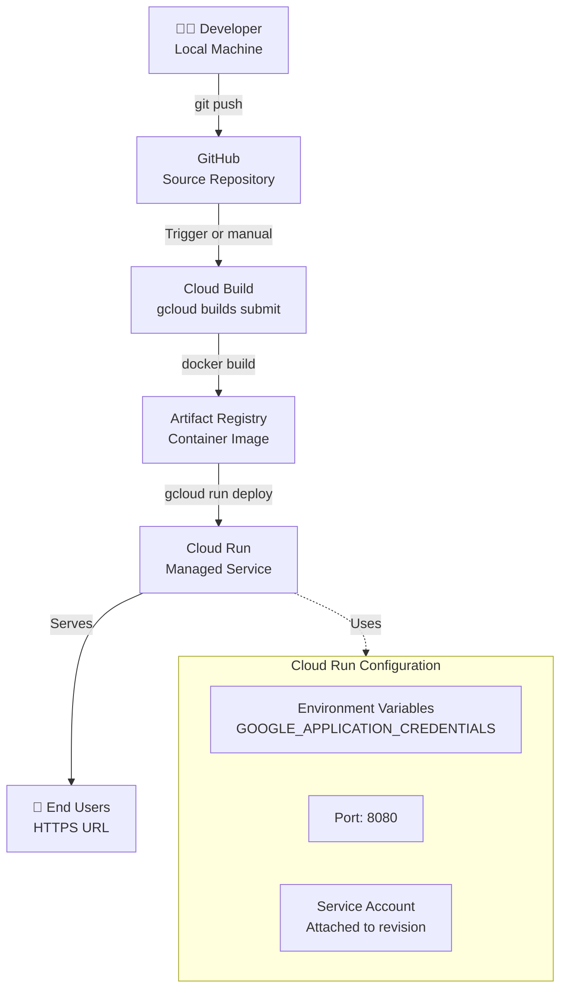

# Deployment

## Cloud Run

Steps:
1. Build container
2. Push to GCR
3. Deploy to Cloud Run

## GitHub Pages

Docs are deployed via GitHub Actions on push to main.

```mermaid
flowchart TD
    DEV["👩‍💻 Developer\nLocal Machine"] -->|git push| GH["GitHub\nSource Repository"]
    GH -->|Trigger or manual| CB["Cloud Build\ngcloud builds submit"]
    CB -->|docker build| AR["Artifact Registry\nContainer Image"]
    AR -->|gcloud run deploy| CR["Cloud Run\nManaged Service"]
    CR -->|Serves| USERS["👥 End Users\nHTTPS URL"]

    subgraph Config ["Cloud Run Configuration"]
        ENV["Environment Variables\nGOOGLE_APPLICATION_CREDENTIALS"]
        PORT["Port: 8080"]
        SA["Service Account\nAttached to revision"]
    end

    CR -.->|Uses| Config
```