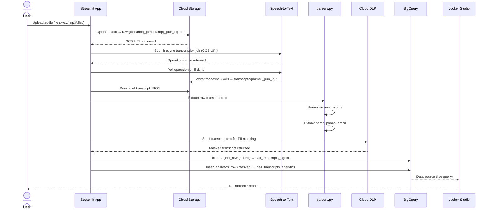

```mermaid
sequenceDiagram
    actor User
    participant App as Streamlit App
    participant GCS as Cloud Storage
    participant STT as Speech-to-Text
    participant Parser as parsers.py
    participant DLP as Cloud DLP
    participant BQ as BigQuery
    participant LS as Looker Studio

    User->>App: Upload audio file (.wav/.mp3/.flac)
    App->>GCS: Upload audio → raw/{filename}_{timestamp}_{run_id}.ext
    GCS-->>App: GCS URI confirmed

    App->>STT: Submit async transcription job (GCS URI)
    STT-->>App: Operation name returned
    App->>STT: Poll operation until done
    STT->>GCS: Write transcript JSON → transcripts/{name}_{run_id}/
    App->>GCS: Download transcript JSON

    App->>Parser: Extract raw transcript text
    Parser->>Parser: Normalise email words
    Parser->>Parser: Extract name, phone, email

    App->>DLP: Send transcript text for PII masking
    DLP-->>App: Masked transcript returned

    App->>BQ: Insert agent_row (full PII) → call_transcripts_agent
    App->>BQ: Insert analytics_row (masked) → call_transcripts_analytics

    BQ-->>LS: Data source (live query)
    LS-->>User: Dashboard / report
```